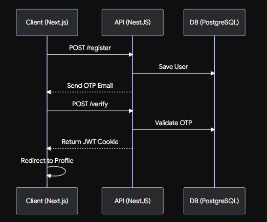

# Expert Finding

- **Scenario**
    - Created by Jobaer (16 - 08 - 2026)
        
        —> A user will first comes and sees the `login` page. If he is not registered then he needs to `register` first with `email` and `password`. He can also do the `Google login`. With email and password authentication the user needs to do `email verification`. He will be taken to `email verification` page and enters the `OTP` that he will receive via email. The OTP will vanish after 5 minutes. If he didn’t received the OTP he can request for `resend OTP` but he will have to wait for 1 minute. 
        
        —> In the login page if the user is already registered but he forgot his password then he can go to `forgot password` page and can `reset his pass`.
        
        —> By default the user will have the `client role`.
        
        —> After successful login or registration the user will be redirected to `profile page`. where he will fill up or input his personal information.
        
        —> Client category selection e category select korbe. dekhte parbe ki ki expert ase.
        
        —> Category searching korte parbe
        
        —> client channel create korte parbe. 
        
        —> channel e jara jukto tara post korte parbe.
        
        —> oi post er under e comment thakbe… (Reddit or stackoverflow er moto)
        
        —> post e react korte parbe channel er member ra.
        
- **Searching**
    1. User knows whom to search for or whom to find. Like, he wants to search for doctor named Dr. Luna where he sits and which day? he just goes to the search bar and searches for her name. 
    2. User doesn’t know whom to search. He is here to find the best expert but he knows about which category of expert he needs. Such as he needs a developer.
        1. He will first select a category named IT. —> `Category selection`
        2. He will select if he needs a frontend, backend or full-stack developer. —> `Sub-category selection`
        3. Suppose he selected a backend selector then he will select whether a js or python developer. —> `sub-sub-category selection`
        4. He may select `location`.
        5. He may select `price range`.
        6. He may select `review counts`.
        7. He may selects `rating range`.
        8. He may want to know if the expert is `verified` or not?
        9. He may search by `organization (Brainstation)`.
        10. He may select `qualification (Bsc, Msc)` .
        11. He may select `language (Bangla, English, Arabic)` .
        12. `Status (Active or not)` 
    3. User doesn’t know what he is looking for. He just goes to the search bar or a chatbot and write a query of his problem. The AI recommends him that he should see a doctor of this field. `(For future)`
- Authentication
    - senario
        
        —> A user will first comes and sees the `login` page. If he is not registered then he needs to `register` first with `email` and `password`. He can also do the `Google login`. With email and password authentication the user needs to do `email verification`. He will be taken to `email verification` page and enters the `OTP` that he will receive via email. The OTP will vanish after 5 minutes. If he didn’t received the OTP he can request for `resend OTP` but he will have to wait for 1 minute. 
        
        —> In the login page if the user is already registered but he forgot his password then he can go to `forgot password` page and can `reset his pass`.
        
        —> By default the user will have the `client role`.
        
        —> After successful login or registration the user will be redirected to `profile page`. where he will fill up or input his personal information.
        
    - Data Flow Diagram
        
        
        
    - API
        
        
        | Endpoint | Method | Purpose |
        | --- | --- | --- |
        | `/auth/register` | `POST` | Creates an unverified user, generates the OTP, sends the email, and returns a `201 Created` status. |
        | `/auth/verify-email` | `POST` | Validates the OTP. If valid, marks the user as verified, issues the JWT cookie, and returns success. |
        | `/auth/resend-otp` | `POST` | Checks if 1 minute has passed since the last OTP. If yes, generates a new 5-minute OTP and emails it. |
        | `/auth/login` | `POST` | Validates email and hashed password. If `isEmailVerified` is false, returns a specific error to trigger the Next.js OTP screen. |
        | `/auth/google` | `GET` | Initiates the Google OAuth2 flow, usually via Passport.js. |
        | `/auth/google/callback` | `GET` | Google redirects here. NestJS creates/finds the user, issues the JWT, and redirects the browser to the Next.js profile page. |
        | `/auth/forgot-password` | `POST` | Generates a `PASSWORD_RESET` OTP and sends the email. |
        | `/auth/reset-password` | `POST` | Validates the reset OTP and updates the hashed password in the database. |
- TECH Stack
    - Frontend - NEXT JS
    - POSTGRESS SQL
    - NEST JS